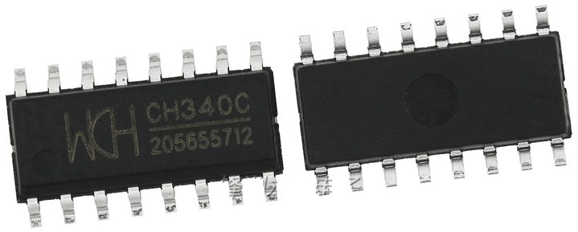

# Vorlage
## Inhaltsverzeichnis
1. [x] [Inhaltsverzeichnis](#Inhaltsverzeichnis)
1. [X] [Beschreibung](#Beschreibung)
   1. [X] [Leitungen](#Leitungen)
1. [ ] [Hardware](#Hardware)
   1. [X] [Technische Daten](#technische-daten)
   1. [X] [Datasheet](#datasheet)
   1. [ ] [PCB](#PCB)
1. [ ] [Software](#Software)
1. [ ] [3D](#3D)
1. [X] [Where to buy](#Where-to-buy)
1. [X] [Abbildungen](#Abbildungen)
1. [x] [Credits](#Credits)

## Beschreibung
IC zur Umwandlung von seriellen Signalen zu USB. 
* Kompatibel mit 5V- und 3,3V-Systemen. 
* 2.0 Full-speed device
* Geschwindigkeit 50bps .. 2Mbps
* integrierter 12MHz crystal, kein externer benötigt
* USB-Vendor-class

http://www.wch-ic.com/products/CH340.html
http://www.wch-ic.com/search?q=CH340&t=downloads

### Leitungen
###### Standard für Arduinos
PIN | Name | Beschreibung | TYP
------------ | ------------- | ------------- | -------------
RX | Receive Data | Leitung für eingehende (von DTE zu empfangende) Daten (negative Logik) | I
TX | Transmit Data | Leitung für ausgehende (von DTE gesendete) Daten ([negative Logik](https://de.wikipedia.org/wiki/Negative_Logik)) | O
DTR | Data Terminal Ready | Mit einem High-Pegel an diesem Ausgang signalisiert DTE seine Betriebsbereitschaft an die Gegenstelle. Damit kann die Gegenstelle, z. B. ein Modem, aktiviert oder auch zurückgesetzt werden. Üblicherweise antwortet die Gegenstelle mit einem High-Pegel auf DSR | O

###### Weitere für RS-232
PIN | Name | Beschreibung | TYP
------------ | ------------- | ------------- | -------------
CTS | Clear to Send | Hardware-Handshake, „Sendeerlaubnis“; Ein High-Pegel an diesem Eingang ist ein Signal der Gegenstelle, dass sie Daten von DTE entgegennehmen kann | I
RTS | Request to Send | Hardware-Handshake, „Sendeanforderung“; ein High-Pegel an diesem Ausgang signalisiert, dass DTE Daten senden möchte | O
RTR (n.v.) | Request to Receive | „Empfangsstatus“; ein High-Pegel an diesem Ausgang signalisiert der Gegenstelle, dass DTE bereit ist, Daten zu empfangen | O
DSR | Data Set Ready | Ein High-Pegel an diesem Eingang ist ein Signal der Gegenstelle, dass sie im Prinzip einsatzbereit ist (aber nicht notwendigerweise auch empfangsbereit, siehe CTS) | I
RI | Ring Indicator | Ein High-Pegel an diesem Eingang signalisiert dem DTE-Gerät, dass ein Anruf ankommt, d. h., dass jemand eine Datenverbindung aufbauen will („ring“ ist engl. für „klingeln“; besonders bei Telefonen und im übertragenen Sinne auch bei Modems). Siehe auch [Rufspannung](https://de.wikipedia.org/wiki/Rufspannung). | I
DCD | Data Carrier Detected | Mit einem High-Pegel an diesem Eingang signalisiert die Gegenstelle, dass sie einlaufende Daten auf der Leitung erkennt (dem Namen nach ist das die [Modulationsträger](https://de.wikipedia.org/wiki/Tr%C3%A4ger_(Nachrichtentechnik)-Erkennung) und an DTE weitergeben möchte | I

## Hardware
### Technische Daten
* Modell: Transceiver USB 2.0 2Mbps
* Typ: WCN CH340C
* Temperaturbereich: ?
* Versorgungsspannung: 3.3 V, 5 V
* LCSC Part #: [C84681](https://lcsc.com/product-detail/USB_CH340C_C84681.html/?href=jlc-SMT)
* EAN / GTIN: ?

### Datasheet
* [TI.com datasheet](https://www.ti.com/lit/ds/symlink/cd74hc4067.pdf)
* 04.11.2008 [snapshot Version 1D](datasheet/CH340_version_1D.PDF)
* unknown [snapshot Version 2C](datasheet/CH340_version_2C.PDF)
* 11.03.2019 chinese [snapshot Version 2G](datasheet/Jiangsu-Qin-Heng-CH340C_C84681.pdf)
### PCB
[SparkFun Serial Basic Breakout - CH340C and USB-C](https://github.com/sparkfun/Serial_Basic_Breakout-CH340C) released under the Creative Commons Attribution Share-Alike 4.0 license; designed by [N. Seidle](https://github.com/nseidle) @nseidle
## Software
## 3D

## Where to buy
~ 4 EUR for 10pcs: [AliExpress](https://www.aliexpress.com/wholesale?trafficChannel=main&d=y&CatId=0&SearchText=10pcs+ch340c&ltype=wholesale&SortType=default&maxPrice=2.6&page=1)
[SparkFun Serial Basic Breakout - CH340C and USB-C](https://www.sparkfun.com/products/15096)

## Abbildungen

## Credits
* :+1: [arduino](https://github.com/arduino)
* :+1: [adafruit](https://github.com/adafruit)
* :+1: [sparkfun](https://github.com/sparkfun)
* :+1: [Watterott](https://github.com/watterott) and @awatterott for great SW, HW and products
* :+1: [atom](https://github.com/atom) 
* :+1: @ikatyang for the [emoji-cheat-sheet](https://github.com/ikatyang/emoji-cheat-sheet/blob/master/README.md)
